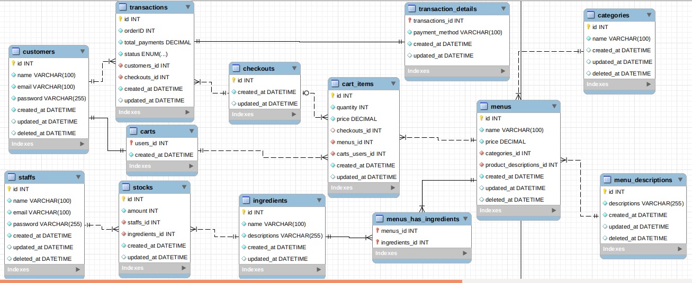

# rumah-makan

in this project i use Golang, MySQL, JWT for authorization.

[](https://pkg.go.dev/gorm.io/gorm?tab=doc)
[](https://github.com/labstack/echo)
```
Framework used in this project is Gorm and Echo. 

The reason behind that is to allow developers to focus on building an unique feature
for their projects rather than re-inventing by coding.
```
```
In this project i also use MVC architectural pattern because it's the most 
common architectural pattern used by programmer
```
